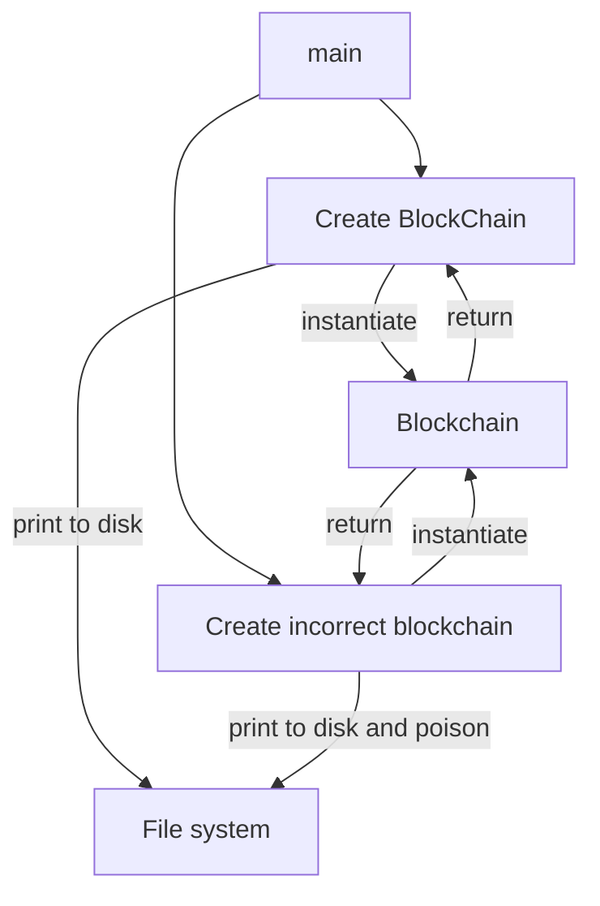
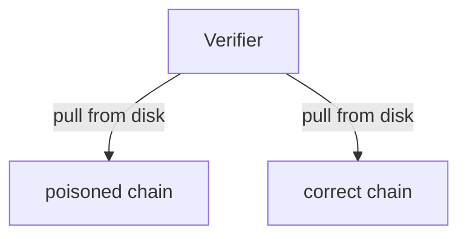

## Architecture Diagram

This architecture is somewhat complicated with a good deal of moving parts. We will attempt to provide clarity here.

```mermaid
graph TD;
    A[main] --> B[Create BlockChain];
    A-->C[Create incorrect blockchain]
    D--return-->B
    D--return-->C
    B--instantiate-->D[Blockchain]
    B--print to disk-->E[File system]
    C--print to disk and poison-->E[File system]
    C--instantiate-->D[Blockchain]
```

```mermaid
graph TD;
    A[Verifier]--pull from disk-->B[poisoned chain]
    A[Verifier]--pull from disk-->C[correct chain]
```